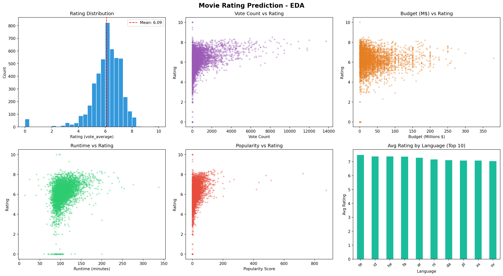
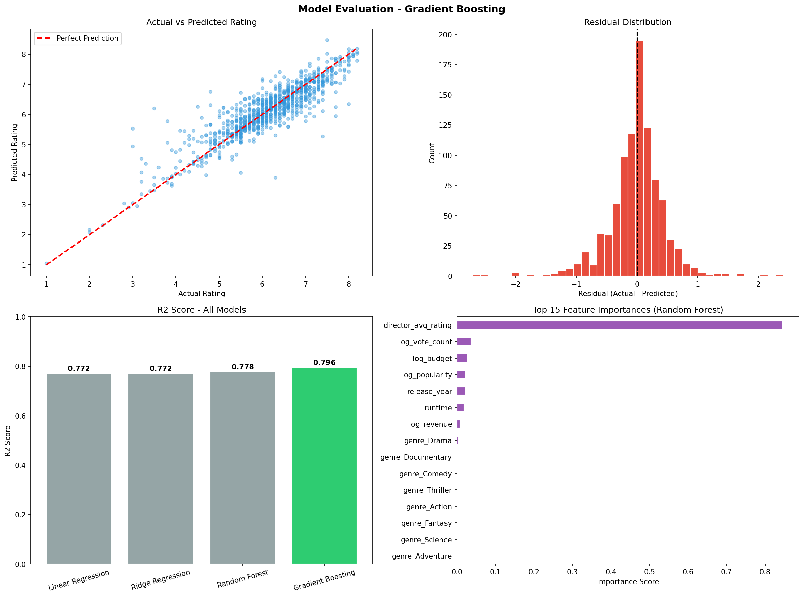

# 🎬 Movie Rating Prediction

A Machine Learning project that predicts **movie ratings** using the **TMDB 5000 Movies Dataset** based on features such as genre, director, cast, budget, revenue, popularity, runtime, and more.

---

## 🚀 Features

- 📊 Exploratory Data Analysis (EDA)
- 🧹 Data Cleaning & Preprocessing
- ⚙️ Feature Engineering
- 🤖 Multiple Regression Models
- 📈 Model Evaluation & Comparison
- 🌟 Feature Importance Analysis

---

## 📂 Project Structure

```text
Movie_rating_prediction/
│── data/
│   └── movies.csv
│
│── plots/
│   ├── movie_eda.png
│   └── movie_evaluation.png
│
│── src/
│   └── movie_rating_prediction.py
│
├── requirements.txt
└── README.md
```

---

## 📊 Dataset

- **Source:** TMDB 5000 Movies Dataset
- **Movies:** 4,803
- **Target:** `vote_average`
- **Problem Type:** Regression

---

## 🤖 Models Used

| Model | R² Score |
|--------|---------:|
| Linear Regression | 0.7717 |
| Ridge Regression | 0.7717 |
| Random Forest | 0.7783 |
| ⭐ Gradient Boosting | **0.7964** |

---

## 🏆 Best Model

**Gradient Boosting Regressor**

- **R² Score:** **0.7964**
- **MAE:** **0.3085**
- **RMSE:** **0.4514**

---

## 📈 Visualizations

### 📊 Exploratory Data Analysis



### 📉 Model Evaluation



---

## ⚙️ Installation

```bash
git clone https://github.com/Akash22-11/Movie_rating_prediction-.git

cd Movie_rating_prediction-

pip install -r requirements.txt

python src/movie_rating_prediction.py
```

---

## 🛠️ Tech Stack

- Python
- Pandas
- NumPy
- Scikit-learn
- Matplotlib
- Seaborn

---

## 📌 Results

- ✔️ Complete ML Pipeline
- ✔️ Feature Engineering
- ✔️ Model Comparison
- ✔️ Professional Visualizations
- ✔️ Accurate Movie Rating Prediction

---
## 👨‍💻 Developer

<div align="center">


### Akash

**Engineering Student • Data Science Enthusiast • Builder**


</div>

<br/>


<div align="center">

⭐ If you found this project useful, consider giving it a star!
